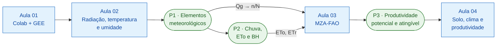
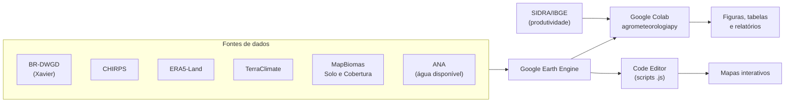
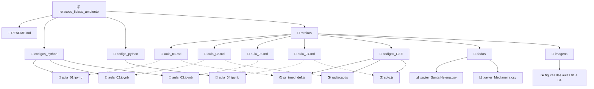

# Relações Físicas do Ambiente Agrícola

[](https://www.python.org/)
[](https://earthengine.google.com/)
[](https://colab.research.google.com/)
[](https://pypi.org/project/agrometeorologiapy/)

Material da disciplina **Relações Físicas do Ambiente Agrícola** do Programa de Pós-Graduação em Tecnologias Computacionais para o Agronegócio (PPGTCA), da Universidade Tecnológica Federal do Paraná (UTFPR), Câmpus Santa Helena.

O repositório funciona como um pequeno livro: cada aula tem um **roteiro** em Markdown, um **notebook** executável no Google Colab e, quando cabe, um **script** para o Code Editor do Google Earth Engine. Os cálculos agrometeorológicos usam a biblioteca [`agrometeorologiapy`](https://pypi.org/project/agrometeorologiapy/).

**Professor:** Prof. Dr. Fabrício Correia de Oliveira · [fcoliveira@utfpr.edu.br](mailto:fcoliveira@utfpr.edu.br)

---

## 🚀 Acesso rápido

| Aula | Tema | Roteiro | Notebook | Script GEE |
|---|---|---|---|---|
| 01 | Colab + Google Earth Engine: acesso, autenticação e fontes de dados | [📄 aula_01.md](roteiros/aula_01.md) | [](https://colab.research.google.com/github/fcoliveira-utfpr/relacoes_fisicas_ambiente/blob/main/codigos_python/aula_01.ipynb) | [🌎 pr_tmed_def.js](roteiros/codigos_GEE/pr_tmed_def.js) |
| 02 | Radiação solar, temperatura e umidade do ar | [📄 aula_02.md](roteiros/aula_02.md) | [](https://colab.research.google.com/github/fcoliveira-utfpr/relacoes_fisicas_ambiente/blob/main/codigos_python/aula_02.ipynb) | [🌎 radiacao.js](roteiros/codigos_GEE/radiacao.js) |
| 03 | Modelo da Zona Agroecológica da FAO (MZA-FAO) | [📄 aula_03.md](roteiros/aula_03.md) | [](https://colab.research.google.com/github/fcoliveira-utfpr/relacoes_fisicas_ambiente/blob/main/codigos_python/aula_03.ipynb) | |
| 04 | O solo entre o clima e a produtividade (extra) | [📄 aula_04.md](roteiros/aula_04.md) | [](https://colab.research.google.com/github/fcoliveira-utfpr/relacoes_fisicas_ambiente/blob/main/codigo_python/aula_04.ipynb) | [🌎 solo.js](roteiros/codigos_GEE/solo.js) |

> 💡 **Scripts GEE:** abra o arquivo `.js`, copie o conteúdo e cole em um script novo no [Code Editor](https://code.earthengine.google.com/). Depois, clique em **Run**.

---

## 📅 Cronograma

| Enc. | Data | Tipo | Conteúdo | Trabalho | Peso |
|---|---|---|---|---|---|
| 1 | 05/10/2026 | Expositiva | Colab + GEE: acesso, autenticação, primeiro script, fontes de dados | Ambiente configurado + área de estudo | |
| 2 | 19/10/2026 | | Sem aula (SICITE) | | |
| 3 | 26/10/2026 | Expositiva | Radiação solar, temperatura e umidade do ar | P1: Elementos meteorológicos | |
| 4 | 09/11/2026 | Apresentação | P1 | | 30% |
| 5 | 16/11/2026 | Expositiva | Modelos de chuva, evapotranspiração e balanço hídrico | P2: Chuva, ETo e BH | |
| 6 | 23/11/2026 | Apresentação | P2 | | 30% |
| 7 | 30/11/2026 | Expositiva | MZA-FAO: produtividade potencial e atingível | P3: Produtividade | |
| 8 | 07/12/2026 | Apresentação | P3 (integrando P1 e P2) | | 40% |
| 9 | 14/12/2026 | Expositiva | O solo entre o clima e a produtividade (extra) | | |

---

## 🧭 Como as aulas se conectam

Os projetos são **encadeados**: cada um usa os resultados do anterior, e a área de estudo escolhida no primeiro encontro é a mesma até o fim.



### Fluxo dos dados



---

## 📁 Estrutura do repositório

```
relacoes_fisicas_ambiente/
│
├── README.md                         ← este arquivo
│
├── codigos_python/                   ← notebooks das aulas (Colab)
│   ├── aula_01.ipynb                 · mapas climatológicos do Paraná
│   ├── aula_02.ipynb                 · Qo, balanço de radiação e amplitude térmica
│   └── aula_03.ipynb                 · MZA-FAO passo a passo (Medianeira, soja)
│
├── codigo_python/
│   └── aula_04.ipynb                 · solo × clima × água disponível × produtividade
│
└── roteiros/                         ← material de leitura das aulas
    ├── aula_01.md
    ├── aula_02.md
    ├── aula_03.md
    ├── aula_04.md
    │
    ├── codigos_GEE/                  ← scripts para o Code Editor
    │   ├── pr_tmed_def.js            · precipitação, temperatura e deficiência (PR)
    │   ├── radiacao.js               · Qo, Qg e Rn mensais (Brasil)
    │   └── solo.js                   · granulometria, textura, carbono, AD e CAD
    │
    ├── dados/                        ← séries usadas nos exemplos
    │   ├── xavier_-54.33_-24.86_2001_2025.csv     · Santa Helena, 2001–2025
    │   └── xavier_Medianeira-PR_20231001_125d.csv · Medianeira, soja 2023/24
    │
    └── imagens/                      ← figuras usadas nos roteiros
        ├── aula01_*.png
        ├── aula02_*.png
        ├── aula03_*.png
        └── aula04_*.png
```



---

## ⚙️ Antes da primeira aula

1. **Conta Google**, de preferência a institucional.
2. **Registro no Earth Engine:** acesse [code.earthengine.google.com/register](https://code.earthengine.google.com/register), escolha **uso não comercial** e crie um projeto no Google Cloud. Anote o **ID do projeto**.
3. **Teste no Colab:**

```python
!pip install -q agrometeorologiapy
import ee
import agrometeorologiapy as amp

ee.Authenticate()
ee.Initialize(project='SEU-ID-DE-PROJETO')
print(ee.String('Earth Engine conectado!').getInfo())
```

> ⚠️ Em todos os notebooks, troque `ID_PROJETO` pelo ID do **seu** projeto antes de executar.

---

## 🗂️ Bases de dados

| Base | Variáveis | Resolução | Uso nas aulas |
|---|---|---|---|
| [BR-DWGD (Xavier et al.)](https://github.com/AlexandreCandidoXavier/BR-DWGD) | Chuva, Tmax, Tmin, Rs, UR, vento, ETo | 0,1°, diária | 02, 03, 04 |
| [CHIRPS](https://developers.google.com/earth-engine/datasets/catalog/UCSB-CHG_CHIRPS_PENTAD) | Precipitação | ~5,5 km, pêntadas | 01 |
| [ERA5-Land](https://developers.google.com/earth-engine/datasets/catalog/ECMWF_ERA5_LAND_MONTHLY_AGGR) | Temperatura do ar | ~11 km, mensal | 01 |
| [TerraClimate](https://developers.google.com/earth-engine/datasets/catalog/IDAHO_EPSCOR_TERRACLIMATE) | Balanço hídrico, ETP, deficiência | ~4 km, mensal | 01, 04 |
| [MapBiomas Solo](https://brasil.mapbiomas.org/) | Granulometria, textura, carbono | 30 m | 04 |
| [MapBiomas Cobertura](https://brasil.mapbiomas.org/) | Uso e cobertura (soja) | 30 m, anual | 04 |
| ANA | Água disponível no solo | vetorial | 04 |
| [SIDRA/IBGE (PAM)](https://sidra.ibge.gov.br/) | Rendimento das culturas | municipal, anual | 03, 04 |

---

## 📚 Referências principais

ALLEN, R. G.; PEREIRA, L. S.; RAES, D.; SMITH, M. **Crop evapotranspiration**: guidelines for computing crop water requirements. Rome: FAO, 1998. (Irrigation and Drainage Paper, 56).

DOORENBOS, J.; KASSAM, A. H. **Yield response to water**. Rome: FAO, 1979. (Irrigation and Drainage Paper, 33).

PEREIRA, A. R.; ANGELOCCI, L. R.; SENTELHAS, P. C. **Agrometeorologia**: fundamentos e aplicações práticas. Guaíba: Agropecuária, 2002.

XAVIER, A. C.; SCANLON, B. R.; KING, C. W.; ALVES, A. I. New improved Brazilian daily weather gridded data (1961–2020). **International Journal of Climatology**, v. 42, n. 16, p. 8390-8404, 2022.

---

<p align="center">
  <b>GAMBI-TEC</b> · Agrometeorologia, Recursos Hídricos e Ciência de Dados Ambientais<br/>
  UTFPR · Câmpus Santa Helena
</p>
