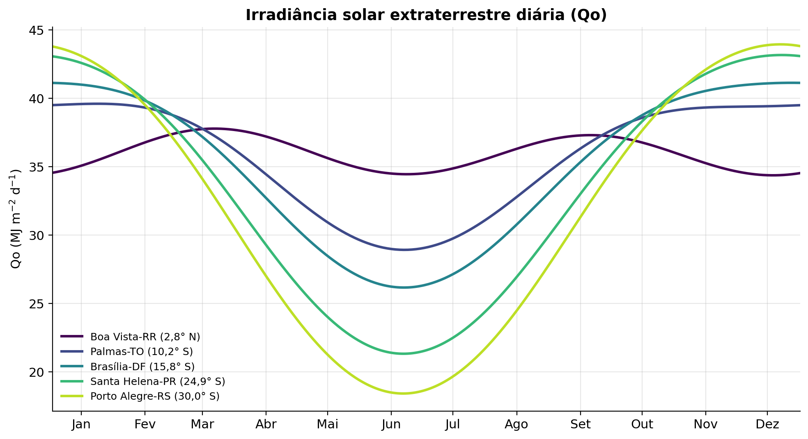
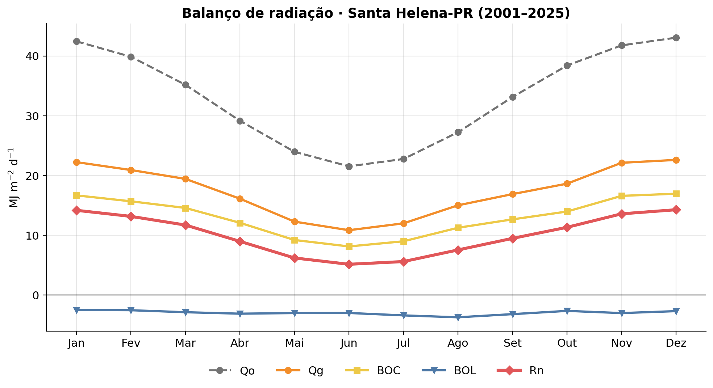
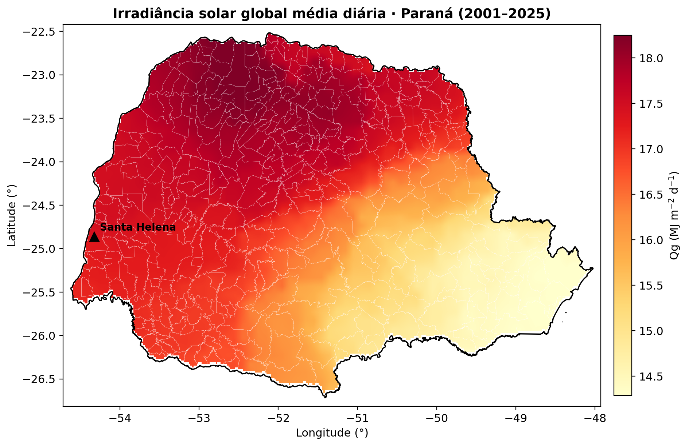
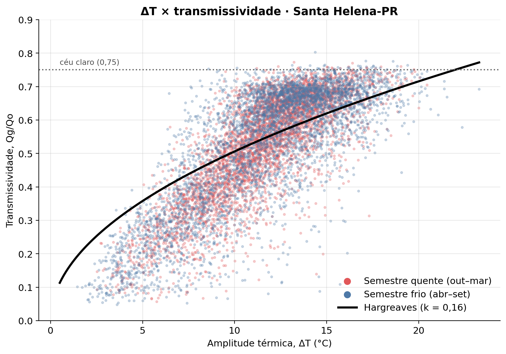
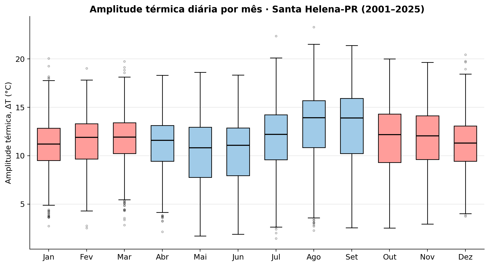

# Aula 02 · Radiação solar, temperatura e umidade do ar

> **Disciplina:** Relações Físicas do Ambiente Agrícola
> **Encontro:** 3 de 9 · 
> **Duração sugerida:** 100 min (ajuste conforme a turma)
> **Trabalho:** Projeto 1, Elementos meteorológicos (apresentação e entrega em 09/11/2026, peso 30%)

---

## Objetivos de aprendizagem

Ao final desta aula, você será capaz de:

1. Calcular a irradiância solar extraterrestre (Qo) e o fotoperíodo (N) para qualquer local e dia do ano.
2. Relacionar a irradiância solar global (Qg) com Qo por meio da transmissividade atmosférica.
3. Calcular o balanço de ondas curtas (BOC), o balanço de ondas longas (BOL) e o saldo de radiação (Rn).
4. Relacionar a amplitude térmica diária à nebulosidade e, portanto, a Qg.
5. Calcular as pressões de vapor a partir da temperatura e da umidade relativa.
6. Compreender a cadeia **temperatura → Qg → Rn → ETo** que estrutura o Projeto 1.
7. Acessar o conjunto BR-DWGD (Xavier et al.) no Earth Engine.

---

## Plano da aula

| Bloco | Tempo | Conteúdo |
|---|---|---|
| 1 | 10 min | Retomada: áreas de estudo dos grupos |
| 2 | 25 min | Qo, Qg e saldo de radiação |
| 3 | 10 min | Temperatura do ar e amplitude térmica |
| 4 | 10 min | Umidade do ar e pressões de vapor |
| 5 | 10 min | A cadeia do Projeto 1 |
| 6 | 15 min | Dados: BR-DWGD no Earth Engine |
| 7 | 10 min | Avaliação de modelos: métricas |
| 8 | 10 min | Organização do Projeto 1 |

---

## 1. Retomada (10 min)

Cada grupo apresenta em **1 minuto** a área de estudo definida na semana anterior.

> ⚠️ **Atenção para o P1:** o local precisa ter uma **estação INMET a até cerca de 10 km**. Se a área escolhida não atender a esse critério, o grupo deve ajustar o ponto de análise dentro dela ainda hoje.

Todos os cálculos desta aula usam a biblioteca `agrometeorologiapy`:

```python
!pip install -q agrometeorologiapy
import agrometeorologiapy as amp
```

---

## 2. Qo, Qg e saldo de radiação (25 min)

### 2.1 Irradiância solar extraterrestre (Qo) e fotoperíodo (N)

A energia solar que chega ao **topo da atmosfera**, sobre uma superfície horizontal, depende apenas da posição relativa entre o Sol e o local. O cálculo segue quatro passos.

**Passo 1. Declinação solar (δ),** em graus, para o número do dia do ano (NDA):

$$\delta = 23{,}45 \cdot \text{sen}\left[\frac{360}{365} \cdot (NDA - 80)\right]$$

**Passo 2. Ângulo horário do nascer do Sol (Hn) e fotoperíodo (N):**

$$H_n = \arccos\left[-\text{tg}(\varphi) \cdot \text{tg}(\delta)\right] \qquad N = \frac{2 \cdot H_n}{15}$$

**Passo 3. Correção da distância Terra-Sol:**

$$\left(\frac{d}{D}\right)^2 = 1 + 0{,}033 \cdot \cos\left(\frac{360}{365} \cdot NDA\right)$$

**Passo 4. Irradiância solar extraterrestre diária** (MJ m⁻² d⁻¹):

$$Q_o = 37{,}6 \cdot \left(\frac{d}{D}\right)^2 \cdot \left[\frac{\pi}{180} \cdot H_n \cdot \text{sen}(\varphi) \cdot \text{sen}(\delta) + \cos(\varphi) \cdot \cos(\delta) \cdot \text{sen}(H_n)\right]$$

em que φ é a latitude (negativa no hemisfério sul) e todos os ângulos estão em graus.

```python
lat = -24.86                                   # Santa Helena-PR

NDA = amp.nda(15, 1)                           # 15 de janeiro
dec = amp.declinacao_solar(NDA)                # δ (graus)
Hn  = amp.angulo_horario_nascer(lat, dec)      # Hn (graus)
N   = amp.fotoperiodo(Hn)                      # N (h)
dD2 = amp.fator_correcao_distancia(NDA)        # (d/D)²
Qo  = amp.irradiancia_extraterrestre(lat, dec, Hn, dD2)

print(f'δ = {dec:.2f}°  Hn = {Hn:.2f}°  N = {N:.2f} h  Qo = {Qo:.2f} MJ m⁻² d⁻¹')
# δ = -21.10°  Hn = 100.30°  N = 13.37 h  Qo = 42.59 MJ m⁻² d⁻¹
```


*Irradiância solar extraterrestre diária em diferentes latitudes brasileiras.*

> 💬 **Pergunta 1:** por que a amplitude anual de Qo é muito maior no Rio Grande do Sul do que em Roraima?

### 2.2 Irradiância solar global (Qg)

Ao atravessar a atmosfera, a radiação é **absorvida** (vapor d'água, ozônio, CO₂), **refletida** (nuvens) e **difundida** (gases e aerossóis). O que chega à superfície é a **irradiância solar global** (Qg). A razão entre as duas é a **transmissividade atmosférica**:

$$\tau = \frac{Q_g}{Q_o}$$

| Condição do céu | τ aproximado |
|---|---|
| Céu limpo | 0,70 a 0,75 |
| Parcialmente nublado | 0,40 a 0,60 |
| Encoberto | 0,15 a 0,30 |

Em dias de céu claro, a FAO-56 estima a **irradiância de céu claro** (Qg,cs) em função da altitude z (m):

$$Q_{g,cs} = \left(0{,}75 + 2 \cdot 10^{-5} \cdot z\right) \cdot Q_o$$

> 🔎 O valor **0,75** aparece em quase todos os modelos de Fernandes et al. (2018). Agora você sabe de onde ele vem.

Quando Qg não é medida, ela pode ser estimada. Duas formas clássicas:

**Angström-Prescott** (variante de Glover-McCulloch), a partir da razão de insolação n/N:

$$Q_g = Q_o \cdot \left[0{,}29 \cdot \cos(\varphi) + 0{,}52 \cdot \frac{n}{N}\right]$$

**Hargreaves**, a partir apenas da amplitude térmica:

$$Q_g = k \cdot (T_{max} - T_{min})^{0{,}5} \cdot Q_o \qquad k = 0{,}16 \ \text{(interior)} \ \text{ou} \ 0{,}19 \ \text{(litoral)}$$

```python
Qg_est = amp.Qg_hargreaves(Tmax=32.0, Tmin=21.0, Qo=Qo)
print(f'Qg (Hargreaves) = {Qg_est:.2f} MJ m⁻² d⁻¹')
# Qg (Hargreaves) = 22.60 MJ m⁻² d⁻¹
```

> 🔎 No P1, o modelo de Hargreaves de Fernandes et al. tem **dois parâmetros calibrados** (b e c), e não o k fixo da biblioteca. A função da biblioteca serve como ponto de partida e comparação.

### 2.3 Balanço de radiação

| Componente | Sigla | Significado |
|---|---|---|
| Balanço de ondas curtas | BOC | Irradiância solar absorvida pela superfície |
| Balanço de ondas longas | BOL | Saldo da radiação térmica (negativo: perda líquida) |
| Saldo de radiação | Rn | Energia disponível para aquecer o ar, o solo e evaporar água |

**Ondas curtas.** A superfície reflete parte de Qg, de acordo com seu coeficiente de reflexão (albedo) r:

$$BOC = Q_g \cdot (1 - r) \qquad r = 0{,}25 \ \text{(gramado)}$$

**Ondas longas.** A superfície emite radiação térmica e recebe a contra-radiação da atmosfera. Pela equação de Stefan-Boltzmann corrigida pela FAO-56:

$$BOL = -\sigma \cdot \left[\frac{T_{max,K}^4 + T_{min,K}^4}{2}\right] \cdot \left(0{,}34 - 0{,}14 \cdot \sqrt{e_a}\right) \cdot \left(1{,}35 \cdot \frac{Q_g}{Q_{g,cs}} - 0{,}35\right)$$

com σ = 4,903 × 10⁻⁹ MJ K⁻⁴ m⁻² d⁻¹ e temperaturas em kelvin.

**Saldo de radiação:**

$$R_n = BOC + BOL$$

Observe os três fatores da equação do BOL:

- a **temperatura** controla quanto a superfície emite;
- a **umidade** (ea) controla quanto a atmosfera devolve;
- a **nebulosidade** (Qg/Qg,cs) controla o "cobertor" de nuvens.

```python
z = 258                                         # altitude (m)
Tmax, Tmin, UR, Qg = 32.0, 21.0, 70, 24.0       # dia de verão

es = (amp.es_tetens(Tmax) + amp.es_tetens(Tmin)) / 2
ea = amp.ea_umidade(es, UR)
Qg_cs = (0.75 + 2e-5 * z) * Qo

BOC = amp.boc_saldo(Qg)
BOL = amp.bol_saldo(Tmax, Tmin, ea, Qg, Qg_cs)
Rn  = amp.saldo_radiacao(BOC, BOL)

print(f'BOC = {BOC:.2f}  BOL = {BOL:.2f}  Rn = {Rn:.2f} MJ m⁻² d⁻¹')
# BOC = 18.00  BOL = -3.05  Rn = 14.95 MJ m⁻² d⁻¹
```

Comparando um dia típico de verão e um de inverno em Santa Helena:

| | 15/jan | 15/jul |
|---|---|---|
| Tmax / Tmin (°C) | 32 / 21 | 22 / 9 |
| UR (%) | 70 | 72 |
| N (h) | 13,37 | 10,61 |
| Qo (MJ m⁻² d⁻¹) | 42,59 | 22,51 |
| Qg (MJ m⁻² d⁻¹) | 24,0 | 12,0 |
| Qg/Qo | 0,56 | 0,53 |
| BOC | 18,00 | 9,00 |
| BOL | −3,05 | −3,63 |
| **Rn** | **14,95** | **5,37** |
| Rn/Qg | 0,62 | 0,45 |

> 💬 **Pergunta 2:** com transmissividade quase igual, por que o BOL é maior (em módulo) no inverno?
>
> 💬 **Pergunta 3:** por que a razão Rn/Qg cai tanto do verão para o inverno?


*Exemplo de climatologia mensal de Qo, Qg, BOC, BOL e Rn. Este é o formato do gráfico pedido na Etapa 2 do P1.*

### 2.4 Panorama no Paraná


*Irradiância solar global média diária no Paraná (BR-DWGD, 2001–2025).*

---

## 3. Temperatura do ar e amplitude térmica (10 min)

A temperatura do ar não é um elemento independente: ela é, em grande parte, **consequência do balanço de radiação**.

- **Tmax** ocorre no início da tarde, depois do pico de Rn, enquanto o saldo energético da superfície ainda é positivo.
- **Tmin** ocorre próximo ao nascer do Sol, após uma noite inteira de perda por ondas longas.

A temperatura média diária é estimada pela média dos extremos:

$$T_{med} = \frac{T_{max} + T_{min}}{2}$$

A **amplitude térmica** (ΔT = Tmax − Tmin) carrega informação sobre as nuvens:

| Céu | Durante o dia | Durante a noite | ΔT |
|---|---|---|---|
| Limpo | Muita irradiância solar, Tmax alta | Muita perda de ondas longas, Tmin baixa | **Grande** |
| Nublado | Pouca irradiância solar, Tmax moderada | Nuvens retêm calor, Tmin alta | **Pequena** |


*Relação entre amplitude térmica diária e transmissividade atmosférica (Qg/Qo).*

Essa é a **ideia central** de todos os modelos de Fernandes et al. (2018): estimar Qg usando apenas temperatura, que é medida em praticamente qualquer estação, enquanto piranômetros são muito menos comuns. Os modelos de Bristow-Campbell, Campbell-Donatelli, Donatelli-Bellocchi e DCBB refinam a ideia de Hargreaves com correções para temperatura mínima, sazonalidade e variação de ΔT ao longo da semana. As equações completas estão no roteiro do Projeto 1.


*Distribuição mensal da amplitude térmica (equivalente à Fig. 2 de Fernandes et al.).*

> 💬 **Pergunta 4:** em qual época do ano você espera a maior amplitude térmica no oeste do Paraná? Por quê?

---

## 4. Umidade do ar e pressões de vapor (10 min)

A quantidade **máxima** de vapor que o ar comporta depende só da temperatura. É a **pressão de saturação de vapor**, dada pela equação de Tetens (kPa):

$$e_s = 0{,}6108 \cdot 10^{\left(\frac{7{,}5 \cdot T}{237{,}3 + T}\right)}$$

Como a relação não é linear, em escala diária usa-se a média das saturações nas temperaturas extremas, e não a saturação da temperatura média:

$$e_s = \frac{e_s(T_{max}) + e_s(T_{min})}{2}$$

A **pressão parcial de vapor** (ea) é a quantidade de vapor efetivamente presente:

$$e_a = e_s \cdot \frac{UR}{100}$$

O **déficit de saturação** (Δe = es − ea) mede o "poder evaporante" do ar e é um dos motores da evapotranspiração.

```python
es_max = amp.es_tetens(32.0)
es_min = amp.es_tetens(21.0)
es = (es_max + es_min) / 2
ea = amp.ea_umidade(es, 70)
de = amp.deficit_saturacao(es, ea)

print(f'es = {es:.3f}  ea = {ea:.3f}  Δe = {de:.3f} kPa')
# es = 3.621  ea = 2.534  Δe = 1.086 kPa
```

> 💬 **Pergunta 5:** por que calcular es pela temperatura média, em vez da média de es(Tmax) e es(Tmin), subestima o valor?

> 🔎 **Onde a umidade entra no P1?** No BOL (via ea) e, depois, na ETo Penman-Monteith que serve de referência.

---

## 5. A cadeia do Projeto 1 (10 min)

O P1 reproduz dois artigos e depois os integra:

```
     Fernandes et al. (2018)              Fietz & Fisch (2009)
  ┌──────────────────────────┐     ┌──────────────────────────────┐
  │ Tmax, Tmin  ──►  Qg      │ ──► │ Qg ──► Rn ──► ETo (Priestley- │
  │ (5 modelos empíricos)    │     │       (4 modelos)   Taylor)  │
  └──────────────────────────┘     └──────────────────────────────┘
```

A pergunta central do projeto é:

> **Se eu tiver apenas termômetro, quanto erro carrego até a ETo? E em que elo da cadeia esse erro nasce?**

### Priestley-Taylor em uma linha

Em condições sem advecção, a evapotranspiração é controlada essencialmente pela energia disponível:

$$ET_0 = \alpha_{PT} \cdot W \cdot \frac{R_n - G}{\lambda} \qquad W = \frac{\Delta}{\Delta + \gamma} \qquad \alpha_{PT} = 1{,}26 \qquad \lambda = 2{,}45 \ \text{MJ kg}^{-1}$$

em que Δ é o declive da curva de pressão de saturação e γ a constante psicrométrica. Na biblioteca, essa equação está em `amp.etp_priestley_taylor`. Fietz & Fisch usam aproximações lineares de W em função da temperatura, que o grupo deve comparar com o W exato.

Se Rn ≈ k · Qg, a equação vira **ET₀ = k · W · Qg**, que é a equação local que o grupo vai deduzir.

---

## 6. Dados: BR-DWGD no Earth Engine (15 min)

O conjunto de Xavier et al. traz dados diários interpolados para todo o Brasil, em grade de 0,1° × 0,1°, de 1961 a 2025: precipitação, Tmax, Tmin, radiação solar, umidade relativa, vento a 2 m e ETo.

### 6.1 Primeiro contato com a coleção

```python
import ee
ee.Authenticate()
ee.Initialize(project='SEU-ID-DE-PROJETO')

xavier = ee.ImageCollection('projects/ee-alexandrexavier/assets/BR-DWGD')

# Quantas imagens? Quais bandas? Que propriedades cada imagem carrega?
primeira = xavier.first()
print('Bandas:', primeira.bandNames().getInfo())
print('Propriedades:', primeira.propertyNames().getInfo())
```

> 🧭 **Tarefa investigativa:** antes de extrair qualquer dado, o grupo deve responder:
> 1. As bandas estão todas em uma imagem por dia, ou cada variável é uma coleção separada?
> 2. Há **fator de escala** ou **offset**? (Dica: compare um valor bruto com a faixa esperada da variável.)
> 3. Qual é o intervalo de datas da coleção?

### 6.2 Extraindo um pequeno trecho

```python
ponto = ee.Geometry.Point([-54.33, -24.86])   # substitua pelo ponto da estação INMET

trecho = xavier.filterDate('2024-01-01', '2024-01-11')
dados = trecho.getRegion(ponto, scale=11000).getInfo()

for linha in dados[:4]:
    print(linha)
```

> ⚠️ **O desafio da extração:** 25 anos de dados diários são mais de 9 mil imagens. Pedir tudo de uma vez **vai estourar o limite do Earth Engine**. Encontrar uma estratégia para contornar isso e documentá-la faz parte da Etapa 1 do projeto.

### 6.3 Ressalvas que devem aparecer no relatório

- A Qg do Xavier **não é medida**: é interpolada a partir de estações. Por isso a estação INMET próxima é obrigatória.
- O BR-DWGD **não tem Rn medido**. O Rn de referência será calculado pela FAO-56, o que é diferente do saldo-radiômetro usado por Fietz & Fisch.

---

## 7. Avaliação de modelos: métricas (10 min)

Sendo Oᵢ o valor observado, Pᵢ o estimado, Ō a média observada e n o número de dias:

| Métrica | Equação | Ideal |
|---|---|---|
| RMSE | $\sqrt{\frac{1}{n} \cdot \sum (P_i - O_i)^2}$ | 0 |
| RRMSE (%) | $100 \cdot \text{RMSE} / \bar{O}$ | 0 |
| MAE | $\frac{1}{n} \cdot \sum \lvert P_i - O_i \rvert$ | 0 |
| EF (Nash-Sutcliffe) | $1 - \frac{\sum (P_i - O_i)^2}{\sum (O_i - \bar{O})^2}$ | 1 |
| d (Willmott) | $1 - \frac{\sum (P_i - O_i)^2}{\sum (\lvert P_i - \bar{O}\rvert + \lvert O_i - \bar{O}\rvert)^2}$ | 1 |
| c (Camargo & Sentelhas) | $r \cdot d$ | 1 |

**Por que tantas métricas?** Porque cada uma enxerga uma coisa:

- **r** (e R²) mede a **precisão**: os pontos acompanham uma reta?
- **d** mede a **exatidão**: essa reta está perto da linha 1:1?
- **RMSE** pune erros grandes; **MAE** trata todos os erros igualmente.
- **EF** compara o modelo com a estimativa mais simples possível: usar sempre a média.

> 💬 **Pergunta 6:** um modelo com r = 0,95 é necessariamente um bom modelo?

> ⚠️ Pelo enunciado do P1, as métricas devem ser implementadas pelo grupo como **funções próprias**.

---

## 8. Organização do Projeto 1 (10 min)

### 8.1 Sugestão de cronograma do grupo

| Semana | Etapas | Meta |
|---|---|---|
| 26/10 a 01/11 | 0, 1 e 2 | Local caracterizado, base consolidada no Drive, balanço de radiação calculado |
| 02/11 a 08/11 | 3, 4 e 5 | Modelos calibrados e validados, cadeia integrada, relatório e apresentação |

> 💡 A Etapa 1 é a mais trabalhosa em tempo de máquina. Comecem por ela **nesta semana**: todas as etapas seguintes dependem da base consolidada.

### 8.2 Dicas práticas

- **Calibração e validação:** anos ímpares para calibrar, anos pares para validar. Separem os dados uma única vez e reutilizem.
- **Ajuste não linear:** `scipy.optimize.curve_fit`. O DB e o DCBB são sensíveis ao chute inicial: testem mais de um e registrem qual funcionou.
- **ΔT de Fernandes:** usa a **Tmin do dia seguinte**. Cuidado com o último dia da série.
- **Albedo:** a biblioteca adota r = 0,25 (gramado); a FAO-56 usa 0,23 para a grama de referência. Definam qual usar e justifiquem.
- **agrometeorologiapy:** antes de escrever qualquer equação padrão, procurem a função na biblioteca. As funções de radiação recebem o NDA como número inteiro; em um DataFrame com índice de datas, use `df.index.dayofyear`.

### 8.3 Entregáveis (09/11/2026)

1. Notebook `.ipynb` executável de ponta a ponta no Colab, com uma seção por etapa.
2. Relatório em formato de artigo curto (6 a 8 páginas).
3. Apresentação de 15 a 20 minutos.

### 8.4 Checklist antes de sair da aula

- [ ] O ponto do grupo tem estação INMET a até ~10 km
- [ ] Já acessamos a coleção BR-DWGD e listamos as bandas
- [ ] Sabemos se há fator de escala nas variáveis
- [ ] Dividimos as etapas entre os integrantes
- [ ] Instalamos a `agrometeorologiapy` no Colab

---

## 9. Respostas das perguntas da aula

**Pergunta 1. Por que a amplitude anual de Qo é muito maior no Rio Grande do Sul do que em Roraima?**

Perto do Equador, o fotoperíodo fica próximo de 12 h o ano inteiro e o Sol do meio-dia passa sempre perto do zênite, porque a declinação solar oscila apenas ±23,45° em torno da latitude local. Com o aumento da latitude, a variação da declinação passa a alterar muito mais a altura do Sol e a duração do dia: no Rio Grande do Sul, o fotoperíodo varia de cerca de 10 h no inverno a 14 h no verão, e o Sol de inverno fica bem mais baixo no horizonte. Os dois efeitos atuam na mesma direção, ampliando a diferença entre verão e inverno.

**Pergunta 2. Com transmissividade quase igual, por que o BOL é maior (em módulo) no inverno?**

A temperatura mais baixa reduz a emissão da superfície (o termo de Stefan-Boltzmann cai de 39,6 para 34,1 MJ m⁻² d⁻¹), mas o ar de inverno é muito mais seco: ea cai de 2,53 para 1,37 kPa. Com menos vapor d'água, a atmosfera devolve menos radiação de onda longa, e o fator de umidade (0,34 − 0,14 · √ea) aumenta de 0,117 para 0,176, ou seja, cerca de 50%. Esse efeito supera a redução da emissão, e a perda líquida aumenta.

**Pergunta 3. Por que a razão Rn/Qg cai tanto do verão para o inverno?**

O BOC é sempre uma fração fixa de Qg (75%), então cai pela metade junto com ela. O BOL, porém, praticamente não diminui; no exemplo, até aumenta. Como Rn = BOC + BOL, uma perda de onda longa quase constante pesa muito mais quando Qg é pequena: no verão, o BOL consome 17% do BOC; no inverno, 40%. Por isso a hipótese de Rn proporcional a Qg (modelo 3 de Fietz & Fisch) precisa ser testada mês a mês no P1.

**Pergunta 4. Em qual época do ano você espera a maior amplitude térmica no oeste do Paraná? Por quê?**

No inverno, especialmente entre julho e agosto. É o período mais seco e com mais dias de céu limpo: durante o dia a irradiância solar aquece a superfície e, à noite, o ar seco e sem nuvens favorece uma grande perda de onda longa, derrubando a Tmin. No verão, a nebulosidade e a umidade elevadas limitam tanto o aquecimento diurno quanto o resfriamento noturno.

**Pergunta 5. Por que calcular es pela temperatura média subestima o valor?**

Porque a curva de Tetens é convexa: es cresce cada vez mais rápido com a temperatura. O aumento de es entre Tmed e Tmax é maior que a redução entre Tmed e Tmin, então a média de es(Tmax) e es(Tmin) é sempre maior que es(Tmed). No exemplo, es(26,5 °C) = 3,46 kPa, enquanto a média dos extremos dá 3,62 kPa. A diferença cresce com a amplitude térmica.

**Pergunta 6. Um modelo com r = 0,95 é necessariamente um bom modelo?**

Não. O r mede apenas se os pontos se alinham em uma reta, não se essa reta coincide com a linha 1:1. Um modelo que superestima sempre 30% teria r alto e, ainda assim, erros grandes. Por isso se usa o índice d, que mede a exatidão, e o índice c = r · d, que combina as duas propriedades.

---

## Referências

ALLEN, R. G.; PEREIRA, L. S.; RAES, D.; SMITH, M. **Crop evapotranspiration**: guidelines for computing crop water requirements. Rome: FAO, 1998. (Irrigation and Drainage Paper, 56).

CAMARGO, A. P.; SENTELHAS, P. C. Avaliação do desempenho de diferentes métodos de estimativa da evapotranspiração potencial no Estado de São Paulo, Brasil. **Revista Brasileira de Agrometeorologia**, v. 5, n. 1, p. 89-97, 1997.

FERNANDES, D. S.; HEINEMANN, A. B.; AMORIM, A. O.; PAZ, R. L. F. Estimativa da radiação solar global com base em observações de temperatura para o estado de Goiás. **Revista Brasileira de Meteorologia**, v. 33, n. 3, p. 558-566, 2018.

FIETZ, C. R.; FISCH, G. F. Avaliação de modelos de estimativa do saldo de radiação e do método de Priestley-Taylor para a região de Dourados, MS. **Revista Brasileira de Engenharia Agrícola e Ambiental**, v. 13, n. 4, p. 449-453, 2009.

WILLMOTT, C. J. On the validation of models. **Physical Geography**, v. 2, p. 184-194, 1981.

XAVIER, A. C.; SCANLON, B. R.; KING, C. W.; ALVES, A. I. New improved Brazilian daily weather gridded data (1961–2020). **International Journal of Climatology**, v. 42, n. 16, p. 8390-8404, 2022.
