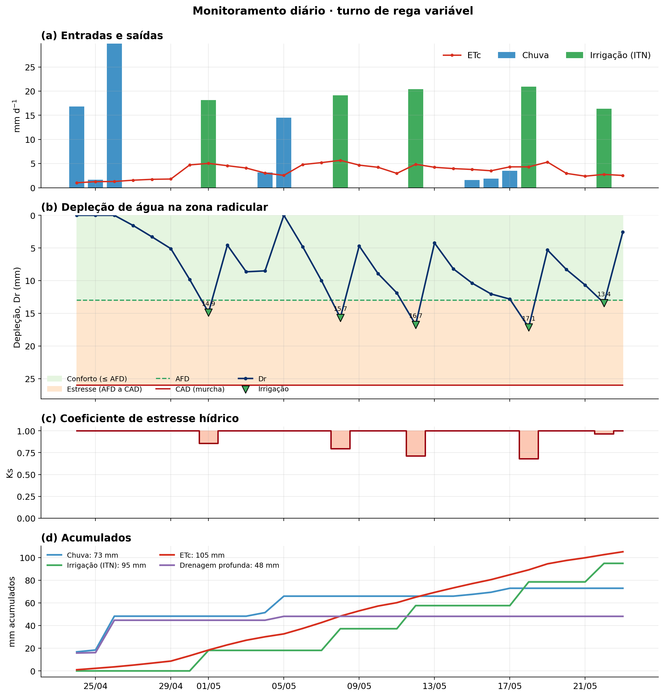
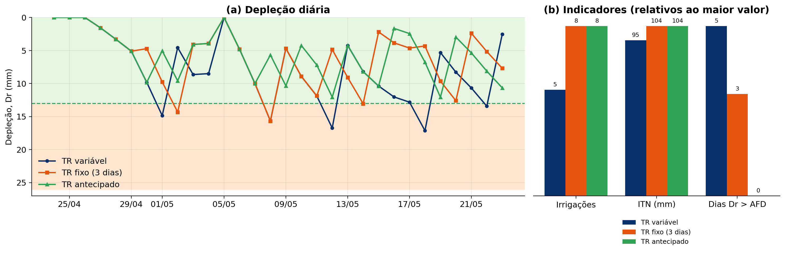

# Manejo da irrigação pelo balanço hídrico

> **Duração sugerida:** 100 min (ajuste conforme a turma)
> **Pré-requisitos:** evapotranspiração de referência (ETo), coeficiente de cultura (Kc) e conceitos de água no solo

---

## Objetivos de aprendizagem

Ao final desta aula, você será capaz de:

1. Calcular a capacidade de água disponível (CAD) e a água facilmente disponível (AFD) a partir das propriedades do solo e da cultura.
2. Escrever a equação do balanço hídrico e justificar as simplificações usadas no manejo da irrigação.
3. Acompanhar dia a dia a depleção de água na zona radicular (Dr).
4. Definir **quando** irrigar (turno de rega variável ou fixo) e **quanto** irrigar (IRN, ITN e tempo de irrigação).
5. Construir e interpretar gráficos de monitoramento diário do balanço hídrico.

---

## Plano da aula

| Bloco | Tempo | Conteúdo |
|---|---|---|
| 1 | 10 min | As duas perguntas do manejo: quando e quanto? |
| 2 | 15 min | Água no solo: CAD e AFD |
| 3 | 10 min | A equação do balanço hídrico |
| 4 | 15 min | Depleção da zona radicular |
| 5 | 10 min | Critérios de irrigação e lâminas |
| 6 | 20 min | Exemplo resolvido |
| 7 | 15 min | Monitoramento diário |
| 8 | 5 min | Fechamento |

---

## 1. As duas perguntas do manejo (10 min)

Todo manejo de irrigação responde a duas perguntas:

| Pergunta | Resposta pelo balanço hídrico |
|---|---|
| **Quando irrigar?** | Quando a água consumida desde a última reposição atingir o limite que a cultura tolera sem estresse (AFD) |
| **Quanto irrigar?** | A quantidade consumida, corrigida pela eficiência do sistema |

O balanço hídrico funciona como uma **conta bancária do solo**: a chuva e a irrigação são depósitos, a evapotranspiração é o saque diário, e a AFD é o limite de saque sem penalidade.

> 💬 **Pergunta 1:** por que não irrigar simplesmente todos os dias, repondo a ETc do dia anterior?

---

## 2. Água no solo: CAD e AFD (15 min)

### 2.1 Capacidade de água disponível (CAD)

É a água retida entre a capacidade de campo (θcc) e o ponto de murcha permanente (θpmp), na camada explorada pelas raízes:

$$CAD = (\theta_{cc} - \theta_{pmp}) \cdot Z \cdot 1000$$

em que CAD está em mm, θ em m³ m⁻³ e Z (profundidade efetiva do sistema radicular) em m.

Quando a umidade é dada em base de massa (U, em %), com densidade do solo ds (g cm⁻³) e Z em cm:

$$CAD = \frac{U_{cc} - U_{pmp}}{10} \cdot d_s \cdot Z$$

### 2.2 Água facilmente disponível (AFD)

Nem toda a CAD é extraída sem esforço: à medida que o solo seca, a planta precisa de mais energia para retirar água, e a transpiração cai. A **AFD** é a fração que a cultura extrai sem reduzir a evapotranspiração:

$$AFD = f \cdot CAD$$

em que f é o fator de disponibilidade (p na FAO-56).

| Cultura | f (FAO-56) | Cultura | f (FAO-56) |
|---|---|---|---|
| Alface | 0,30 | Feijão | 0,45 |
| Cebola | 0,30 | Girassol | 0,45 |
| Batata | 0,35 | Soja | 0,50 |
| Tomate | 0,40 | Milho | 0,55 |
| Café | 0,40 | Trigo | 0,55 |
| Repolho | 0,45 | Cana-de-açúcar | 0,65 |

Os valores tabelados valem para ETc ≈ 5 mm d⁻¹. A FAO-56 sugere um ajuste à demanda atmosférica:

$$f_{aj} = f_{tab} + 0{,}04 \cdot (5 - ETc) \qquad 0{,}1 \leq f_{aj} \leq 0{,}8$$

> 🔎 Em dias de alta demanda, f diminui: com o ar muito seco e quente, a planta entra em estresse com o solo ainda relativamente úmido.

**Exemplo:** solo com θcc = 0,38 m³ m⁻³, θpmp = 0,25 m³ m⁻³, Z = 0,20 m e f = 0,50:

$$CAD = (0{,}38 - 0{,}25) \cdot 0{,}20 \cdot 1000 = 26 \ \text{mm} \qquad AFD = 0{,}50 \cdot 26 = 13 \ \text{mm}$$

São esses os valores usados no exemplo da seção 6.

---

## 3. A equação do balanço hídrico (10 min)

Em um volume de solo que vai da superfície até a profundidade das raízes, a **variação** do armazenamento é a diferença entre entradas e saídas:

$$\Delta ARM = P + I + O + R_i + D_{Li} + AC - ET - R_o - D_{Lo} - DP$$

| Entradas | | Saídas | |
|---|---|---|---|
| P | Precipitação | ET | Evapotranspiração |
| I | Irrigação | R_o | Escoamento superficial (saída) |
| O | Orvalho | D_Lo | Escoamento subsuperficial (saída) |
| R_i | Escoamento superficial (entrada) | DP | Drenagem profunda |
| D_Li | Escoamento subsuperficial (entrada) | | |
| AC | Ascensão capilar | | |

**Simplificações usuais no manejo:**

- **Orvalho:** desprezível, exceto em regiões muito áridas.
- **Ascensão capilar:** desprezível, exceto com lençol freático raso.
- **Fluxos horizontais:** em áreas homogêneas, entradas e saídas se compensam.
- **Escoamento superficial:** desprezado em áreas planas com boa infiltração.

Com isso, a equação fica:

$$\Delta ARM = P + I - ETc - DP$$

---

## 4. Depleção da zona radicular (15 min)

### 4.1 Pensar no que falta, e não no que tem

Em vez de acompanhar o armazenamento, a FAO-56 acompanha a **depleção** (Dr): quanto falta para o solo voltar à capacidade de campo. O balanço diário é:

$$D_{r,i} = D_{r,i-1} + ETc_i - P_i - I_i$$

com duas restrições físicas:

- **Dr não pode ser negativa.** Se a chuva ou a irrigação ultrapassarem o que falta para a capacidade de campo, o excesso é perdido por drenagem profunda:

$$\text{se } D_{r,i} < 0: \quad DP_i = -D_{r,i} \quad \text{e} \quad D_{r,i} = 0$$

- **Dr não pode passar da CAD.** O armazenamento é obtido diretamente:

$$ARM_i = CAD - D_{r,i}$$

> ⚠️ **Por que não usar Pe = mín(P; ETc)?** Essa simplificação limita a chuva aproveitada à ETc do dia. Com isso, uma chuva de 30 mm sobre um solo com 10 mm de depleção é contada como se só repusesse a ETc do dia, e o déficit acumulado continua "na conta". Na formulação pela depleção, a chuva primeiro **zera o déficit acumulado** e só o excedente vira drenagem.

### 4.2 Quando Dr passa da AFD: o coeficiente de estresse (Ks)

Se a irrigação atrasar e Dr ultrapassar a AFD, a cultura passa a transpirar menos que a ETc. A FAO-56 representa isso pelo coeficiente de estresse hídrico:

$$K_s = \frac{CAD - D_r}{(1 - f) \cdot CAD} \quad (D_r > AFD) \qquad ETr = K_s \cdot ETc$$

Com Dr ≤ AFD, Ks = 1.

---

## 5. Critérios de irrigação e lâminas (10 min)

### 5.1 Quando irrigar

| Critério | Regra | Vantagem | Limitação |
|---|---|---|---|
| **Turno de rega variável** | Irrigar quando Dr ≥ AFD | Usa toda a AFD, menos irrigações | Exige acompanhamento diário |
| **Turno de rega fixo** | Irrigar a cada TR dias, repondo Dr | Facilita a logística da propriedade | Irriga com Dr baixa ou deixa Dr passar da AFD |

O turno de rega máximo pode ser estimado por:

$$TR_{max} = \frac{AFD}{ETc_{max}}$$

### 5.2 Quanto irrigar

**Irrigação real necessária (IRN):** a depleção no momento da irrigação.

$$IRN = D_r$$

**Irrigação total necessária (ITN):** corrige a IRN pela eficiência de aplicação (Ea):

$$ITN = \frac{IRN}{E_a}$$

| Sistema | Ea típica |
|---|---|
| Gotejamento | 0,90 a 0,95 |
| Microaspersão | 0,85 a 0,90 |
| Pivô central | 0,80 a 0,90 |
| Aspersão convencional | 0,75 a 0,85 |
| Autopropelido | 0,70 a 0,80 |
| Sulcos | 0,50 a 0,70 |

**Intensidade de aplicação** (Ia, mm h⁻¹), com vazão do emissor q (L h⁻¹) e espaçamentos entre linhas laterais Sr e entre emissores Se (m):

$$I_a = \frac{q}{S_r \cdot S_e}$$

**Tempo de irrigação:**

$$T_i = \frac{ITN}{I_a}$$

> 🔎 A lâmina a aplicar é a **depleção acumulada** no dia da irrigação (IRN = Dr), e não exatamente a AFD. No turno variável, Dr costuma passar um pouco da AFD no dia em que o limite é atingido.

---

## 6. Exemplo resolvido (20 min)

**Dados:** cultura com CAD = 26 mm, AFD = 13 mm, Ea = 0,82 e Ia = 22 mm h⁻¹. O solo está na capacidade de campo no início do período. ETc = Kc · ETo, com Kc de 0,70 (dias 1 a 6), 0,80 (7 a 14), 0,90 (15 a 26) e 0,53 (27 a 30).

### 6.1 Turno de rega variável (irrigar quando Dr ≥ AFD)

Dr é o valor no fim do dia, antes da irrigação.

| DAE | Data | P | ETo | Kc | ETc | Dr | DP | IRN | ITN | Ti (h:min) |
|---|---|---|---|---|---|---|---|---|---|---|
| 1 | 24/04 | 16,81 | 3,4 | 0,70 | 2,38 | 0,00 | 14,43 | 0,00 | 0,00 | — |
| 2 | 25/04 | 1,64 | 4,2 | 0,70 | 2,94 | 1,30 | 0,00 | 0,00 | 0,00 | — |
| 3 | 26/04 | 29,85 | 4,3 | 0,70 | 3,01 | 0,00 | 25,54 | 0,00 | 0,00 | — |
| 4 | 27/04 | 0,00 | 5,2 | 0,70 | 3,64 | 3,64 | 0,00 | 0,00 | 0,00 | — |
| 5 | 28/04 | 0,00 | 5,8 | 0,70 | 4,06 | 7,70 | 0,00 | 0,00 | 0,00 | — |
| 6 | 29/04 | 0,00 | 6,0 | 0,70 | 4,20 | 11,90 | 0,00 | 0,00 | 0,00 | — |
| 7 | 30/04 | 0,00 | 5,9 | 0,80 | 4,72 | 16,62 | 0,00 | **16,62** | 20,27 | 0:55 |
| 8 | 01/05 | 0,00 | 6,3 | 0,80 | 5,04 | 5,04 | 0,00 | 0,00 | 0,00 | — |
| 9 | 02/05 | 0,00 | 5,7 | 0,80 | 4,56 | 9,60 | 0,00 | 0,00 | 0,00 | — |
| 10 | 03/05 | 0,00 | 5,1 | 0,80 | 4,08 | 13,68 | 0,00 | **13,68** | 16,68 | 0:45 |
| 11 | 04/05 | 3,18 | 3,8 | 0,80 | 3,04 | 0,00 | 0,14 | 0,00 | 0,00 | — |
| 12 | 05/05 | 14,49 | 3,2 | 0,80 | 2,56 | 0,00 | 11,93 | 0,00 | 0,00 | — |
| 13 | 06/05 | 0,00 | 6,0 | 0,80 | 4,80 | 4,80 | 0,00 | 0,00 | 0,00 | — |
| 14 | 07/05 | 0,00 | 6,5 | 0,80 | 5,20 | 10,00 | 0,00 | 0,00 | 0,00 | — |
| 15 | 08/05 | 0,00 | 6,3 | 0,90 | 5,67 | 15,67 | 0,00 | **15,67** | 19,11 | 0:52 |
| 16 | 09/05 | 0,00 | 5,2 | 0,90 | 4,68 | 4,68 | 0,00 | 0,00 | 0,00 | — |
| 17 | 10/05 | 0,00 | 4,7 | 0,90 | 4,23 | 8,91 | 0,00 | 0,00 | 0,00 | — |
| 18 | 11/05 | 0,00 | 3,3 | 0,90 | 2,97 | 11,88 | 0,00 | 0,00 | 0,00 | — |
| 19 | 12/05 | 0,00 | 5,4 | 0,90 | 4,86 | 16,74 | 0,00 | **16,74** | 20,41 | 0:56 |
| 20 | 13/05 | 0,00 | 4,7 | 0,90 | 4,23 | 4,23 | 0,00 | 0,00 | 0,00 | — |
| 21 | 14/05 | 0,00 | 4,4 | 0,90 | 3,96 | 8,19 | 0,00 | 0,00 | 0,00 | — |
| 22 | 15/05 | 1,59 | 4,2 | 0,90 | 3,78 | 10,38 | 0,00 | 0,00 | 0,00 | — |
| 23 | 16/05 | 1,86 | 3,9 | 0,90 | 3,51 | 12,03 | 0,00 | 0,00 | 0,00 | — |
| 24 | 17/05 | 3,53 | 4,8 | 0,90 | 4,32 | 12,82 | 0,00 | 0,00 | 0,00 | — |
| 25 | 18/05 | 0,00 | 4,8 | 0,90 | 4,32 | 17,14 | 0,00 | **17,14** | 20,90 | 0:57 |
| 26 | 19/05 | 0,00 | 5,9 | 0,90 | 5,31 | 5,31 | 0,00 | 0,00 | 0,00 | — |
| 27 | 20/05 | 0,00 | 5,6 | 0,53 | 2,97 | 8,28 | 0,00 | 0,00 | 0,00 | — |
| 28 | 21/05 | 0,00 | 4,5 | 0,53 | 2,39 | 10,67 | 0,00 | 0,00 | 0,00 | — |
| 29 | 22/05 | 0,00 | 5,2 | 0,53 | 2,76 | 13,43 | 0,00 | **13,43** | 16,38 | 0:45 |
| 30 | 23/05 | 0,00 | 4,8 | 0,53 | 2,54 | 2,54 | 0,00 | 0,00 | 0,00 | — |

### 6.2 Turno de rega fixo (TR = 3 dias)

Irriga-se a cada 3 dias, repondo a depleção acumulada. Nos dias 3 e 12, a chuva já tinha levado o solo à capacidade de campo (Dr = 0), e a irrigação é **cancelada**.

| Irrigação | Dia | Dr = IRN (mm) | ITN (mm) | Ti (h:min) |
|---|---|---|---|---|
| 1 | 6 | 11,90 | 14,51 | 0:40 |
| 2 | 9 | 14,32 | 17,46 | 0:48 |
| 3 | 15 | 15,67 | 19,11 | 0:52 |
| 4 | 18 | 11,88 | 14,49 | 0:40 |
| 5 | 21 | 13,05 | 15,91 | 0:43 |
| 6 | 24 | 4,63 | 5,65 | 0:15 |
| 7 | 27 | 12,60 | 15,37 | 0:42 |
| 8 | 30 | 7,69 | 9,38 | 0:26 |

### 6.3 Comparação

| Indicador | TR variável | TR fixo (3 dias) |
|---|---|---|
| Número de irrigações | 6 | 8 |
| IRN total (mm) | 93,28 | 91,74 |
| ITN total (mm) | 113,76 | 111,88 |
| Tempo total de irrigação | 5 h 10 min | 5 h 05 min |
| Drenagem profunda (mm) | 52,04 | 47,96 |
| Dias com Dr > AFD | 6 | 4 |

> 💬 **Pergunta 2:** no turno variável, a depleção passou da AFD em todas as irrigações (até 17,14 mm, contra AFD de 13 mm). O que isso significa para a cultura? Como mudar o critério para evitar?

> 💬 **Pergunta 3:** o turno fixo fez mais irrigações, mas aplicou praticamente a mesma lâmina total. Então qual é a desvantagem dele?

---

## 7. Monitoramento diário (15 min)

O balanço hídrico só funciona como ferramenta de manejo se for **acompanhado todos os dias**. O gráfico de monitoramento reúne, em um mesmo painel, as entradas, as saídas e o estado do solo.

*Painel de monitoramento diário com turno de rega variável.*

**Como ler o painel:**

| Painel | O que mostra | O que observar |
|---|---|---|
| Entradas e saídas | Barras de chuva e irrigação; linha de ETc | Dias de chuva intensa, picos de demanda |
| Depleção (Dr) | Dr diária com as faixas de AFD e CAD | Dias em que Dr passa da AFD: estresse |
| Armazenamento | ARM = CAD − Dr, com a linha da capacidade de campo | Velocidade de secagem do solo |
| Acumulados | Chuva, irrigação, ETc e drenagem acumuladas | Eficiência do uso da água no período |

*Depleção diária no turno variável e no turno fixo.*

> 💡 **Validação no campo:** o balanço hídrico acumula erros de ETo, Kc e chuva. Medidas periódicas de umidade (tensiômetros, sensores capacitivos, TDR) permitem "zerar" o balanço, recalibrando Dr com o valor medido.

---

## 8. Fechamento (5 min)

### Atividade

Com os dados da seção 6:

1. Refaça o balanço com f ajustado à ETc diária (seção 2.2). Quantas irrigações mudam?
2. Teste um critério antecipado: irrigar quando Dr + ETc do dia ≥ AFD. Quantos dias com estresse sobram?
3. Compare a drenagem profunda com TR = 2 e TR = 4 dias.

---

## 9. Respostas das perguntas da aula

**Pergunta 1. Por que não irrigar todos os dias, repondo a ETc do dia anterior?**

É possível, e é o que se faz em gotejamento de alta frequência. Em sistemas por aspersão ou superfície, irrigações diárias e pequenas aumentam as perdas por evaporação da superfície molhada e por deriva do vento, molham repetidamente a parte aérea (favorecendo doenças) e exigem mais operações de bombeamento e mão de obra. Além disso, aproveitam pior a chuva: com o solo sempre na capacidade de campo, qualquer chuva vira drenagem profunda. Manter um "espaço" no solo até a AFD permite que a chuva seja armazenada.

**Pergunta 2. Dr passou da AFD em todas as irrigações do turno variável. O que isso significa e como evitar?**

Significa que, no dia da irrigação, a cultura já estava em estresse leve: com Dr = 17,14 mm e AFD = 13 mm, o Ks é (26 − 17,14) / (0,5 · 26) = 0,68, ou seja, a cultura transpirou cerca de 30% a menos naquele dia. Isso acontece porque o critério "irrigar quando Dr ≥ AFD" só é verificado no fim do dia em que o limite já foi ultrapassado. Para evitar, antecipe a decisão: irrigue quando Dr + ETc prevista para o dia seguinte ≥ AFD, ou trabalhe com uma margem de segurança (por exemplo, 90% da AFD).

**Pergunta 3. O turno fixo aplicou quase a mesma lâmina. Qual é a desvantagem?**

A lâmina total é parecida porque, no fim, as duas estratégias repõem a mesma ETc. A desvantagem está na distribuição: o turno fixo faz irrigações com lâminas muito diferentes (de 4,63 a 15,67 mm), algumas pequenas demais para justificar uma operação, e não se ajusta à demanda. Quando a ETc sobe, três dias passam a ser tempo demais e a depleção ultrapassa a AFD (dia 15, com 15,67 mm). Quando a ETc cai, irriga-se antes da hora. O turno fixo é útil pela logística, mas precisa de TR menor ou igual a AFD/ETc máxima e da regra de cancelar a irrigação quando a chuva já repôs o solo.

---

## Referências

ALLEN, R. G.; PEREIRA, L. S.; RAES, D.; SMITH, M. **Crop evapotranspiration**: guidelines for computing crop water requirements. Rome: FAO, 1998. (Irrigation and Drainage Paper, 56).

BERNARDO, S.; MANTOVANI, E. C.; SILVA, D. D.; SOARES, A. A. **Manual de irrigação**. 9. ed. Viçosa: Editora UFV, 2019.

MANTOVANI, E. C.; BERNARDO, S.; PALARETTI, L. F. **Irrigação**: princípios e métodos. 3. ed. Viçosa: Editora UFV, 2009.
